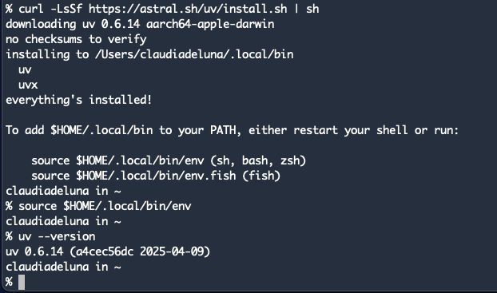
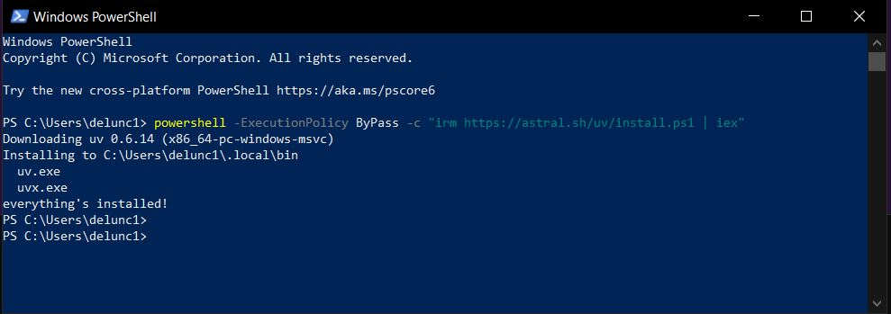

# UV Installation and Testing

## What is UV?

Astral's uv is a fast, all-in-one Python package and project manager written in Rust that unifies and accelerates Python development workflows by replacing multiple tools—including pip, pip-tools, poetry, pipx, pyenv, virtualenv, and twine—with a single, high-performance utility. It handles package installation, dependency resolution, virtual environments, project and Python version management, script execution, and package publishing, all with a familiar CLI and dramatic speed improvements. By consolidating these capabilities, uv simplifies and streamlines Python development for everything from individual scripts to complex multi-workspace projects.

## Why are we using it?

Because UV is a comprehensive package manager it should be easier to create the necessary **Python virtual environments** for the scripts we will be executing in our Jinja2 workshop.

## Install UV

### Mac and Linux

```bash
curl -LsSf https://astral.sh/uv/install.sh | sh

# Temporarily add to the current PowerShell session’s PATH:
source $HOME/.local/bin/env

# Verify it worked (See screen shot below for expected output)
uv --version
```



### Windows (PowerShell)

Install uv using PowerShell

``` 
powershell -ExecutionPolicy ByPass -c "irm https://astral.sh/uv/install.ps1 | iex"

```


When you install `uv` on **Windows using PowerShell**, the installer typically adds the `uv` binary to your user’s `AppData\Local\uv\bin` directory. However, **this change won't take effect in the same terminal session unless you manually update the `PATH` variable**.

```powershell
# Update the PATH in your current PowerShell session so you can use uv right away.
# Make sure you include the quotes
"$env:USERPROFILE\AppData\Local\uv\bin"

# Temporarily add to the current PowerShell session’s PATH:
$env:Path += ";$env:USERPROFILE\AppData\Local\uv\bin"

# Verify it worked
uv --version

```

If you have any problems, open up a new PowerShell window and try to execute the `uv --version` command.

If that does not work, please review the uv installation instructions:

##### [Official UV Installation Guide](https://docs.astral.sh/uv/getting-started/installation/)

Tip: Make It Permanent (System/User Environment Variable)

If you want `uv` to always be available from any new terminal:

```
[Environment]::SetEnvironmentVariable("Path", $env:Path + ";$env:USERPROFILE\AppData\Local\uv\bin", "User")
```

Then open up a new terminal.

---

## What to do with this Repository?

**Download or Clone** the repository and move into the repository directory (unzip if you used the download option).

This repository is intended to: 

1. provide brief instructions on installing **uv**
2. provide a small Python script to test the installation

No virtual environment needs to be built or activated.

Executing the test script should

1. Install Python version 3.11.12
2. Create a virtual environment on demand when the script is run and install the requests module
3. Sucessfully execute the script

Example of the inline script metadata:

```python
# /// script
# requires-python = "==3.11.12"
# dependencies = [
#     "requests",
# ]
# ///
```


## Execute Test Script

```bash
uv run requests_test_uv.py  
```

Expected output:

```python
% uv run requests_test_uv.py                                 

Python version:
3.11.12
Virtual environment path: /Users/claudiadeluna/.cache/uv/environments-v2/requests-test-uv-2b697ea58d864f8d


Number of countries: 250


Common name of the first country: South Georgia


CCA3 of the first country: SGS


Found country with CCA3 code: CZE Czech Republic

{'altSpellings': ['CZ', 'Česká republika', 'Česko'],
 'area': 78865.0,
 'borders': ['AUT', 'DEU', 'POL', 'SVK'],
 'capital': ['Prague'],
 'capitalInfo': {'latlng': [50.08, 14.47]},
 'car': {'side': 'right', 'signs': ['CZ']},
 'cca2': 'CZ',
 'cca3': 'CZE',
 'ccn3': '203',
 'cioc': 'CZE',
 'coatOfArms': {'png': 'https://mainfacts.com/media/images/coats_of_arms/cz.png',
                'svg': 'https://mainfacts.com/media/images/coats_of_arms/cz.svg'},
 'continents': ['Europe'],
 'currencies': {'CZK': {'name': 'Czech koruna', 'symbol': 'Kč'}},
 'demonyms': {'eng': {'f': 'Czech', 'm': 'Czech'},
              'fra': {'f': 'Tchèque', 'm': 'Tchèque'}},
 'fifa': 'CZE',
 'flag': '🇨🇿',
 'flags': {'alt': 'The flag of Czechia is composed of two equal horizontal '
                  'bands of white and red, with a blue isosceles triangle '
                  'superimposed on the hoist side of the field. The triangle '
                  'has its base on the hoist end and spans about two-fifth the '
                  'width of the field.',
           'png': 'https://flagcdn.com/w320/cz.png',
           'svg': 'https://flagcdn.com/cz.svg'},
 'gini': {'2018': 25.0},
 'idd': {'root': '+4', 'suffixes': ['20']},
 'independent': True,
 'landlocked': True,
 'languages': {'ces': 'Czech', 'slk': 'Slovak'},
 'latlng': [49.75, 15.5],
 'maps': {'googleMaps': 'https://goo.gl/maps/47dmgeXMZyhDHyQW8',
          'openStreetMaps': 'https://www.openstreetmap.org/relation/51684'},
 'name': {'common': 'Czechia',
          'nativeName': {'ces': {'common': 'Česko',
                                 'official': 'Česká republika'},
                         'slk': {'common': 'Česko',
                                 'official': 'Česká republika'}},
          'official': 'Czech Republic'},
 'population': 10698896,
 'postalCode': {'format': '### ##', 'regex': '^(\\d{5})$'},
 'region': 'Europe',
 'startOfWeek': 'monday',
 'status': 'officially-assigned',
 'subregion': 'Central Europe',
 'timezones': ['UTC+01:00'],
 'tld': ['.cz'],
 'translations': {'ara': {'common': 'التشيك', 'official': 'جمهورية التشيك'},
                  'bre': {'common': 'Tchekia', 'official': 'Republik Tchek'},
                  'ces': {'common': 'Česko', 'official': 'Česká republika'},
                  'cym': {'common': 'Y Weriniaeth Tsiec',
                          'official': 'Y Weriniaeth Tsiec'},
                  'deu': {'common': 'Tschechien',
                          'official': 'Tschechische Republik'},
                  'est': {'common': 'Tšehhi', 'official': 'Tšehhi Vabariik'},
                  'fin': {'common': 'Tšekki', 'official': 'Tšekin tasavalta'},
                  'fra': {'common': 'Tchéquie',
                          'official': 'République tchèque'},
                  'hrv': {'common': 'Češka', 'official': 'Češka'},
                  'hun': {'common': 'Csehország',
                          'official': 'Cseh Köztársaság'},
                  'ita': {'common': 'Cechia', 'official': 'Repubblica Ceca'},
                  'jpn': {'common': 'チェコ', 'official': 'チェコ共和国'},
                  'kor': {'common': '체코', 'official': '체코'},
                  'nld': {'common': 'Tsjechië',
                          'official': 'Tsjechische Republiek'},
                  'per': {'common': 'جمهوری چک', 'official': 'جمهوری چک'},
                  'pol': {'common': 'Czechy', 'official': 'Republika Czeska'},
                  'por': {'common': 'Chéquia', 'official': 'República Checa'},
                  'rus': {'common': 'Чехия', 'official': 'Чешская Республика'},
                  'slk': {'common': 'Česko', 'official': 'Česká republika'},
                  'spa': {'common': 'Chequia', 'official': 'República Checa'},
                  'srp': {'common': 'Чешка', 'official': 'Чешка Република'},
                  'swe': {'common': 'Tjeckien',
                          'official': 'Republiken Tjeckien'},
                  'tur': {'common': 'Çekya', 'official': 'Çek Cumhuriyeti'},
                  'urd': {'common': 'چيک', 'official': 'چيک جمہوريہ'},
                  'zho': {'common': '捷克', 'official': '捷克共和国'}},
 'unMember': True}


Keys of the first country dictionary:
['name',
 'tld',
 'cca2',
 'ccn3',
 'cca3',
 'independent',
 'status',
 'unMember',
 'currencies',
 'idd',
 'capital',
 'altSpellings',
 'region',
 'languages',
 'translations',
 'latlng',
 'landlocked',
 'area',
 'demonyms',
 'flag',
 'maps',
 'population',
 'car',
 'timezones',
 'continents',
 'flags',
 'coatOfArms',
 'startOfWeek',
 'capitalInfo']
claudiadeluna in ~/Indigo Wire Networks Dropbox/Claudia de Luna/scripts/python/2025/uv_it on main
% 

```


#### Inline Script Metadata

https://docs.astral.sh/uv/guides/scripts/#running-a-script-with-dependencies


### Handy Commands

| Command                                    | Description                                                  |
| ------------------------------------------ | ------------------------------------------------------------ |
| `uv --version`                             | Good test to confirm **uv** is installed as well as checking the version |
| `uv python list`                           | Will display the versions of Python available/installed under **uv** management |
| `uv python install 3.10`                   | Install the latest version of Python 3.10 under uv. This is functionaly often implemented with `pyenv`. |
| `uv add --script example.py --python 3.12` | UV will add inline script metadata including the required version of Python <br />to a TOML "header" in the example.py script.  This gives the script all it <br />needs to be executed (run) under **uv** and create the required <br />virtual environment without any further action from the user. |
| `uv run myscript.py`                       | This is the equivalent of of 'python myscript.py' but running it <br />under **uv** manages the virtual environment creation. |
|                                            |                                                              |
|                                            |                                                              |


